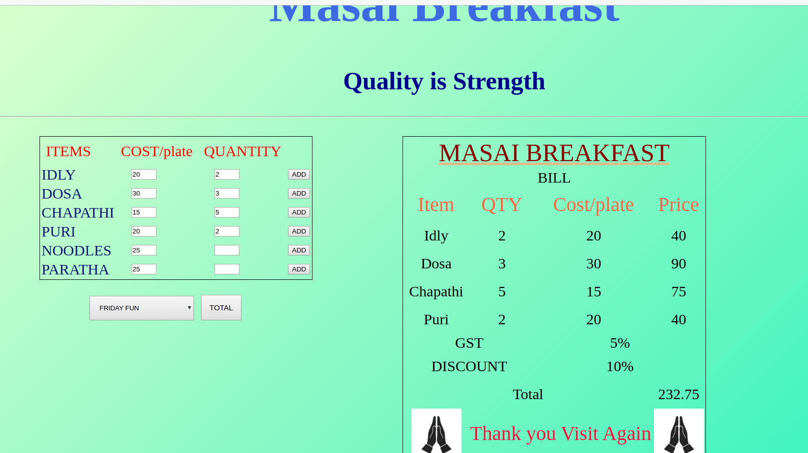

# Bill-Generator

[Demo](https://udaykiran199715.github.io/Bill-Generator/)

### Overview of the project:

User can generate the bill by adding quantity of the items and also can choose the offers and apply the discount. Based on the discount and offers the total bill is calculated.

### Steps:

1. User should give a value in the quantity input boxes after that when he/she click on the add button it automatically appended on the bill.

2. If the user want to give any discount to the customer then select the offers in the select box and click on the Total button based on the selected offer the bill will generated.

### If you want to run in your local device just run the below command.

>git clone https://github.com/udaykiran199715/Bill-Generator.git
